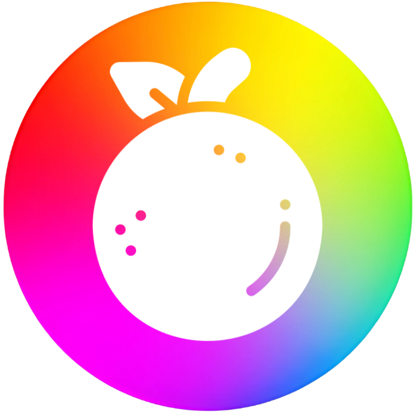

# Lemona

**An integrated writing editor with AI for large worlds.**

[Download](#-download) •
[Features](#-features) •
[Demo](#-demo) •
[Website](https://lemona.studio)

---

## ✨ Features

The stories we love most feel alive—where every corner and every detail connects. Lemona exists to help creators grow endless worlds, alive with detail.

| Feature | Description |
|---------|-------------|
| **Smart Rewrites** | Generate alternatives until every word feels right |
| **Full-Context Understanding** | Deep understanding and recall of your entire work |
| **World Laboratory** | Transform disconnected ideas into complete, vivid pictures |
| **One-Click Import** | Bring your work in from anywhere, take it everywhere |
| **Version Control** | Never lose a draft, moment, or version of your work again |

---

## 🎬 Demo

<video src="frontend/src/assets/demo-videos/lemona_demo.mp4" controls width="800"></video>

---

## 📥 Download

<table>
<tr>
<td width="50%">

### Windows

**[⬇ Download for Windows](https://github.com/BlackLotus0930/Lemona_Studio/releases/latest)**

Click "More info" → "Run anyway" if Windows shows a security warning.

</td>
<td width="50%">

### macOS & Linux

*macOS and Linux builds coming soon*

</td>
</tr>
</table>

---

## 🛠 Built With

- **Electron** — Cross-platform desktop app
- **React** — Frontend framework
- **TypeScript** — Type-safe development
- **Tiptap** — Rich text editor

---

## 🤝 Contributing

Contributions are welcome! Please feel free to [open an issue](https://github.com/BlackLotus0930/Lemona_Studio/issues) or submit a pull request.

---

## 📄 License

This project is licensed under the ISC License.

---

**Made with ♥ by [Black Lotus](https://lemona.studio)**

[Website](https://lemona.studio) •
[GitHub](https://github.com/BlackLotus0930/Lemona_Studio) •
[Discord](https://discord.com/invite/Yp7nuEUmHJ) •
[Report Issue](https://github.com/BlackLotus0930/Lemona_Studio/issues/new)

